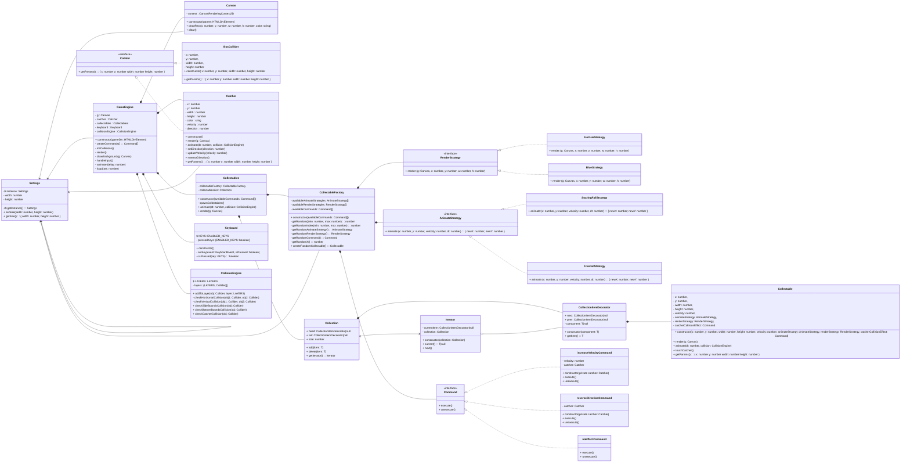

- [UML диаграмма общих взаимосвязей](#uml-диаграмма-классов)

## UML диаграмма классов

```mermaid
classDiagram
  direction LR
  class GameEngine {
      - g : Canvas
      - catcher : Catcher
      - collectables : Collectables
      - keyboard : Keyboard
      - collisionEngine : CollisionEngine
      + constructor(gameDiv: HTMLDivElement)
      - createCommands() : Command[]
      - initCollisions()
      - render()
      - drawBackground(g: Canvas)
      - handleInput()
      - animate(delay: number)
      - loop(last: number)
  }
  
  class Canvas {
      - context : CanvasRenderingContext2D
      + constructor(parent: HTMLDivElement)
      + drawRect(x: number, y: number, w: number, h: number, color: string)
      + clear()
  }
  
  class Collider {
      <<interface>>
      + getParams(): #123; x: number y: number width: number height: number #125;
  }

  class BoxCollider {
      - x: number,
      - y: number,
      - width: number,
      - height: number
      + constructor( x: number, y: number, width: number, height: number
      + getParams(): #123; x: number y: number width: number height: number #125;
  }

  class Catcher {
      - x : number
      - y : number
      - width : number
      - height : number
      - color : sring
      - velocity : number
      - direction : number
      + constructor()
      + render(g: Canvas)
      + animate(dt: number, collision: CollisionEngine)
      + setDirection(direction: number)
      + updateVelocity(velocity: number)
      + reverseDirection()
      + getParams(): #123; x: number y: number width: number height: number #125; 
  }
  
  class Collectables {
      - collectableFactory: CollectableFactory
      - collectablesList: Collection
      + constructor(availableCommands: Command[])
      - spawnCollectables()
      + animate(dt: number, collision: CollisionEngine)
      + render(g: Canvas)
  }
  
  class CollectableFactory {
      - availableAnimateStrategies: AnimateStrategy[]
      - availableRenderStrategies: RenderStrategy[]
      - availableCommands: Command[]
      + constructor(availableCommands: Command[])
      - getRandom((min: number, max: number): number
      - getRandomIndex(min: number, max: number): number
      - getRandomAnimateStrategy(): AnimateStrategy
      - getRandomRenderStrategy(): RenderStrategy
      - getRandomCommand(): Command
      - getRandomX(): number
      + createRandomCollectable(): Collectable
  }
  
  class Collectable {
      - x: number,
      - y: number,
      - width: number,
      - height: number,
      - velocity: number,
      - animateStrategy: AnimateStrategy,
      - renderStrategy: RenderStrategy,
      - catcherCollisionEffect: Command
      + constructor(x: number, y: number, width: number, height: number, velocity: number, animateStrategy: AnimateStrategy, renderStrategy: RenderStrategy, catcherCollisionEffect: Command)
      + render(g: Canvas)
      + animate(dt: number, collision: CollisionEngine)
      + touchCatcher()
      + getParams(): #123; x: number y: number width: number height: number #125;
  }
  
  class RenderStrategy {
      <<interface>>
      + render: (g: Canvas, x: number, y: number, w: number, h: number)
  }

  class FuchsiaStrategy {
      + render: (g: Canvas, x: number, y: number, w: number, h: number)
  }

  class BlueStrategy {
      + render: (g: Canvas, x: number, y: number, w: number, h: number)
  }

  class AnimateStrategy {
      <<interface>>
      + animate: (x: number, y: number, velocity: number, dt: number): #123; newX: number; newY: number #125;
  }

  class SoaringFallStrategy {
      + animate: (x: number, y: number, velocity: number, dt: number): #123; newX: number; newY: number #125;
  }

  class FreeFallStrategy {
      + animate: (x: number, y: number, velocity: number, dt: number): #123; newX: number; newY: number #125;
  }
  
  class Collection {
      + head: CollectionItemDecorator<T>|null
      + tail: CollectionItemDecorator<T>|null
      + size: number
      + add(item: T)
      + delete(item: T)
      + getIterator(): Iterator<T>
  }
  
  class Iterator {
      - currentItem: CollectionItemDecorator<T>|null
      - collection: Collection<T>
      + constructor(collection: Collection<T>)
      + current(): T|null
      + next()
  }
  
  class CollectionItemDecorator {
      + next: CollectionItemDecorator<T>|null
      + prev: CollectionItemDecorator<T>|null
      - component: T|null
      + constructor(component: T)
      + getItem(): T
  }
  
  class Command {
      <<interface>>
      + execute()
      + unexecute()
  }
  
  class increaseVelocityCommand {
      - velocity: number
      - catcher: Catcher
      + constructor(private catcher: Catcher)
      + execute()
      + unexecute()
  }
  
  class reverseDirectionCommand {
      - catcher: Catcher
      + constructor(private catcher: Catcher)
      + execute()
      + unexecute()
  }
  
  class noEffectCommand {
      + execute()
      + unexecute()
  }
  
  class Keyboard {
      $ KEYS: ENABLED_KEYS
      - pressedKeys: #123;ENABLED_KEYS: boolean#125;
      + constructor()
      - setKey(event: KeyboardEvent, isPressed: boolean)
      + isPressed(key: KEYS): boolean
  }
  
  class CollisionEngine {
      $ LAYERS: LAYERS
      - layers: #123;LAYERS, Collider[]#125;
      + addToLayer(obj: Collider, layer: LAYERS)
      - checkHorizontalCollision(obj1: Collider, obj2: Collider)
      - checkVerticalCollision(obj1: Collider, obj2: Collider)
      + checkSideBoundsCollision(obj: Collider)
      + checkBottomBoundsCollision(obj: Collider)
      + checkCatcherCollision(obj: Collider)
  }
  
  class Settings {
      -$ instance: Settings
      - width: number
      - height: number
      +$ getInstance(): Settings
      + setSize(width: number, height: number)
      + getSize(): #123; width: number, height: number #125;
  }
  
  GameEngine *-- Canvas
  GameEngine *-- Catcher
  GameEngine *-- Collectables
  GameEngine *-- Keyboard
  GameEngine *-- CollisionEngine
  Collectables *-- CollectableFactory
  CollectableFactory *-- RenderStrategy
  CollectableFactory *-- AnimateStrategy
  CollectableFactory *-- Command
  RenderStrategy <|.. FuchsiaStrategy
  RenderStrategy <|.. BlueStrategy
  AnimateStrategy <|.. SoaringFallStrategy
  AnimateStrategy <|.. FreeFallStrategy
  Command <|.. increaseVelocityCommand
  Command <|.. reverseDirectionCommand
  Command <|.. noEffectCommand
  Collectables *-- Collection
  Collider <|.. Catcher
  Collider <|.. BoxCollider
  Collection <--> Iterator
  Collection *-- CollectionItemDecorator
  Iterator o-- CollectionItemDecorator
  CollectionItemDecorator *-- Collectable
  Settings <-- Settings
  Settings <-- Canvas
  Settings <-- Catcher
  Settings <-- CollectableFactory
  Settings <-- GameEngine
    
```