- [UML диаграмма общих взаимосвязей](#uml-диаграмма-классов)
- [Базовые классы](#базовые-классы)
  - [GameEngine](#gameengine)
  - [CollisionEngine](#collisionengine)
  - [Canvas](#canvas)
  - [Keyboard](#keyboard)
  - [Settings](#settings)
- [Классы игровых объектов](#классы-игровых-объектов)
  - [Catcher](#catcher)
  - [Collectable](#collectable)
- [Вспомогательные классы](#вспомогательные-классы)
  - [AnimateStrategy](#animatestrategy)
  - [RenderStrategy](#renderstrategy)
  - [Command](#command)
  - [Collider](#collider)
  - [Collectables](#collectables)
  - [CollectableFactory](#collectablefactory)
  - [Collection](#collection)
  - [CollectionItemDecorator](#collectionitemdecorator)
  - [Iterator](#iterator)

## UML диаграмма классов

```mermaid
classDiagram
  direction LR
  class GameEngine {
      - g : Canvas
      - catcher : Catcher
      - collectables : Collectables
      - keyboard : Keyboard
      - lives : Lives
      - score : Score
      - collisionFactory : CollisionFactory
      - collisionEngine : CollisionEngine
      + constructor(gameDiv: HTMLDivElement)
      - createCommands() : Command[]
      - initCollisions()
      - render()
      - drawBackground(g: Canvas)
      - handleInput()
      - animate(delay: number)
      - loop(last: number)
  }
  
  class Canvas {
      - context : CanvasRenderingContext2D
      + constructor(parent: HTMLDivElement)
      + drawRect(x: number, y: number, w: number, h: number, color: string)
      + drawText(x: number, y: number, text: string, fontSize: number, color: string)
      + clear()
  }
  
  class Collider {
      <<interface>>
      + getParams(): #123; x: number y: number width: number height: number #125;
  }

  class BoxCollider {
      - x: number,
      - y: number,
      - width: number,
      - height: number
      + constructor( x: number, y: number, width: number, height: number
      + getParams(): #123; x: number y: number width: number height: number #125;
  }

  class Catcher {
      - x : number
      - y : number
      - width : number
      - height : number
      - color : sring
      - velocity : number
      - direction : number
      + constructor()
      + render(g: Canvas)
      + animate(dt: number, collision: CollisionEngine)
      + setDirection(direction: number)
      + updateVelocity(velocity: number)
      + reverseDirection()
      + getParams(): #123; x: number y: number width: number height: number #125; 
  }
  
  class Collectables {
      - collectableFactory: CollectableFactory
      - collectablesList: Collection
      + constructor(availableCommands: Command[])
      - spawnCollectables()
      + animate(dt: number, collision: CollisionEngine)
      + render(g: Canvas)
  }
  
  class CollectableFactory {
      - availableAnimateStrategies: AnimateStrategy[]
      - availableRenderStrategies: RenderStrategy[]
      - availableCommands: CollectableEffects
      + constructor(availableCommands: Command[])
      - getRandom((min: number, max: number): number
      - getRandomIndex(min: number, max: number): number
      - getRandomAnimateStrategy(): AnimateStrategy
      - getRandomRenderStrategy(): RenderStrategy
      - getRandomCommand(positive: boolean): Command
      - getRandomX(): number
      + createPositiveCollectable(): Collectable
      + createNegativeCollectable(): Collectable
      + createRandomCollectable(): Collectable
  }
  
  class Collectable {
      - x: number,
      - y: number,
      - width: number,
      - height: number,
      - velocity: number,
      - animateStrategy: AnimateStrategy,
      - renderStrategy: RenderStrategy,
      - catcherCollisionEffect: Command
      - bottomBoundCollisionEffect: Command: Command
      + constructor(x: number, y: number, width: number, height: number, velocity: number, animateStrategy: AnimateStrategy, renderStrategy: RenderStrategy, catcherCollisionEffect: Command, bottomBoundCollisionEffect: Command)
      + render(g: Canvas)
      + animate(dt: number, collision: CollisionEngine)
      + touchCatcher()
      + touchBottomBound()
      + getParams(): #123; x: number y: number width: number height: number #125;
  }
  
  class RenderStrategy {
      <<interface>>
      + render: (g: Canvas, x: number, y: number, w: number, h: number)
  }

  class FuchsiaStrategy {
      + render: (g: Canvas, x: number, y: number, w: number, h: number)
  }

  class BlueStrategy {
      + render: (g: Canvas, x: number, y: number, w: number, h: number)
  }

  class AnimateStrategy {
      <<interface>>
      + animate: (x: number, y: number, velocity: number, dt: number): #123; newX: number; newY: number #125;
  }

  class SoaringFallStrategy {
      + animate: (x: number, y: number, velocity: number, dt: number): #123; newX: number; newY: number #125;
  }

  class FreeFallStrategy {
      + animate: (x: number, y: number, velocity: number, dt: number): #123; newX: number; newY: number #125;
  }
  
  class Collection {
      + head: CollectionItemDecorator<T>|null
      + tail: CollectionItemDecorator<T>|null
      + size: number
      + add(item: T)
      + delete(item: T)
      + getIterator(): Iterator<T>
  }
  
  class Iterator {
      - currentItem: CollectionItemDecorator<T>|null
      - collection: Collection<T>
      + constructor(collection: Collection<T>)
      + current(): T|null
      + next()
  }
  
  class CollectionItemDecorator {
      + next: CollectionItemDecorator<T>|null
      + prev: CollectionItemDecorator<T>|null
      - component: T|null
      + constructor(component: T)
      + getItem(): T
  }
  
  class Command {
      <<interface>>
      + execute()
      + unexecute()
  }
  
  class MacroCommand {
      - commandList: Command[]
      + add(command: Command)
      + execute()
      + unexecute()
  }
  
  class IncreaseVelocityCommand {
      - velocity: number
      - catcher: Catcher
      + constructor(catcher: Catcher)
      + execute()
      + unexecute()
  }

  class IncreaseScoreCommand {
      - score: Score
      - scoreDelta: number
      + constructor(score: Score, scoreDelta: number)
      + execute()
      + unexecute()
  }
  
  class ReverseDirectionCommand {
      - catcher: Catcher
      + constructor(catcher: Catcher)
      + execute()
      + unexecute()
  }

  class LoseLiveCommand {
      - lives: Lives
      + constructor(lives: Lives)
      + execute()
      + unexecute()
  }
  
  class NoEffectCommand {
      + execute()
      + unexecute()
  }
  
  class Keyboard {
      $ KEYS: ENABLED_KEYS
      - pressedKeys: #123;ENABLED_KEYS: boolean#125;
      + constructor()
      - setKey(event: KeyboardEvent, isPressed: boolean)
      + isPressed(key: KEYS): boolean
  }
  
  class Lives {
      - lives
      - x
      - y
      - width
      - height
      + constructor()
      + render(g: Canvas)
      + decreaseLives()
      + isAlive(): boolean
 }

  class Score {
      - score
      - x
      - y
      - fontSize
      + constructor()
      + render(g: Canvas)
      + increaseScore()
      + getScore(): number
  }

  
  class CollisionEngine {
      $ LAYERS: LAYERS
      - layers: #123;LAYERS, Collider[]#125;
      + addToLayer(obj: Collider, layer: LAYERS)
      - checkHorizontalCollision(obj1: Collider, obj2: Collider)
      - checkVerticalCollision(obj1: Collider, obj2: Collider)
      + checkSideBoundsCollision(obj: Collider)
      + checkBottomBoundsCollision(obj: Collider)
      + checkCatcherCollision(obj: Collider)
  }
  
  class Settings {
      -$ instance: Settings
      - width: number
      - height: number
      +$ getInstance(): Settings
      + setSize(width: number, height: number)
      + getSize(): #123; width: number, height: number #125;
  }
  
  GameEngine *-- Canvas
  GameEngine *-- Catcher
  GameEngine *-- Collectables
  GameEngine *-- CollectableFactory
  GameEngine *-- Keyboard
  GameEngine *-- Score
  GameEngine *-- Lives
  GameEngine *-- CollisionEngine
  Collectables *-- CollectableFactory
  CollectableFactory *-- RenderStrategy
  CollectableFactory *-- AnimateStrategy
  CollectableFactory *-- Command
  RenderStrategy <|.. FuchsiaStrategy
  RenderStrategy <|.. BlueStrategy
  AnimateStrategy <|.. SoaringFallStrategy
  AnimateStrategy <|.. FreeFallStrategy
  Command <|.. IncreaseVelocityCommand
  Command <|.. ReverseDirectionCommand
  Command <|.. NoEffectCommand
  Command <|.. LoseLiveCommand
  Command <|.. IncreaseScoreCommand
  Command <|.. MacroCommand
  Collectables *-- Collection
  Collider <|.. Catcher
  Collider <|.. BoxCollider
  Collection <--> Iterator
  Collection *-- CollectionItemDecorator
  Iterator o-- CollectionItemDecorator
  CollectionItemDecorator *-- Collectable
  Settings <-- Settings
  Settings <-- Canvas
  Settings <-- Catcher
  Settings <-- CollectableFactory
  Settings <-- GameEngine
    
```



## Базовые классы
### GameEngine

Основной класс, здесь запускается игровой цикл и инициализируются все остальные объекты

Аргументы конструктора

|       Имя       | Описание                                                                                                      |
|:---------------:|:--------------------------------------------------------------------------------------------------------------|
|     gameDiv     | Елемент типа `HTMLDivElement` в котором будет инициализирован `canvas`                                        |
| endGameCallback | Функция которая будет вызвана при завершении игры, в качестве аргумента передается количество набранных очков |

Пример инициализации
```react
const Game: React.FC = () => {
  const gameDiv = useRef<HTMLDivElement>(null)
  useEffect(() => {
    if (gameDiv.current && gameDiv.current.childNodes.length === 0) {
      new GameEngine(gameDiv.current, window.alert)
    }
  }, [])
  return <div ref={gameDiv} />
}
```

### CollisionEngine

Класс движка столкновений, содержит физические слои и может проверять наличие коллизий любого `Collider` c любым слоем.
Допустимые слои хранятся в статическом ENUM

Пример инициализации и использования
```typescript
const collisionEngine = new CollisionEngine()
collisionEngine.addToLayer(
  new BoxCollider(0, 200, 200, 0),
  CollisionEngine.LAYERS.BOTTOM_BOUNDS
)
if (collisionEngine.checkBottomBoundsCollision(new BoxCollider(100, 20, 20, 100))) {
  doSomeThing()
  return
}
```

### Canvas

Класс для взаимодействия с CanvasRenderingContext2D

Аргументы конструктора

|  Имя   | Описание                                                               |
|:------:|:-----------------------------------------------------------------------|
| parent | Елемент типа `HTMLDivElement` в котором будет инициализирован `canvas` |

Пример инициализации и использования
```typescript
const g = new Canvas(gameDiv)
g.drawRect(0, 0, 50, 50, '#FFFFFF')
g.clear()
```


### Keyboard

Класс для отслеживания нажатия клавиш на клавиатуре.
Допустимые клавиши хранятся в статическом ENUM 

Пример инициализации и использования
```typescript
const keyboard = new Keyboard()
if (this.keyboard.isPressed(Keyboard.KEYS.LEFT)) {
  doSomeThing()
  return
}
```

### Lives

Класс отвечает да подсчет жизней и отображение их на экране

### Score

Класс отвечает да подсчет очков и отображение их на экране

### Settings

Класс для хранения настроек размера игрового окна, существует в единственном экземпляре

Пример инициализации и использования
```typescript
Settings.getInstance().setSize(800, 600)
const { width, height } = Settings.getInstance().getSize()
```

## Классы игровых объектов

### Catcher

Класс ловца, управляется игроком, содержит информацию о местоположении, скорости, направлении движения.

Описание методов

|      Метод       | Описание                                                    |
|:----------------:|:------------------------------------------------------------|
|      render      | Отрисовка объекта на `canvas`, вызывается на каждом кадре   |
|     animate      | Перемещение объекта по `canvas`, вызывается на каждом кадре |
|   setDirection   | Установить направление движение                             |
|  updateVelocity  | Увеличить скорость на передаваемое значение                 |
| reverseDirection | Изменить направление на противоположное                     |
|    getParams     | Вернуть значение `Collider` для просчета коллизий           |

### Collectable

Класс собираемого объекта, содержит информацию о местоположении, скорости, направлении движения.

Аргументы конструктора

|          Имя           | Описание                                                                   |
|:----------------------:|:---------------------------------------------------------------------------|
|           x            | Начальное положение по координате X                                        |
|           y            | Начальное положение по координате Y                                        |
|         width          | Ширина                                                                     |
|         height         | Высота                                                                     |
|        velocity        | Скорость                                                                   |
|    animateStrategy     | Объект класса AnimateStrategy, управляет движением объекта                 |
|     renderStrategy     | Объект класса RenderStrategy, управляет отрисовкой объекта                 |
| catcherCollisionEffect | Объект класса Command, управляет эффектов от столкновения объекта с ловцом |


Описание методов

|    Метод     | Описание                                                    |
|:------------:|:------------------------------------------------------------|
|    render    | Отрисовка объекта на `canvas`, вызывается на каждом кадре   |
|   animate    | Перемещение объекта по `canvas`, вызывается на каждом кадре |
| touchCatcher | Запустить команду назначенную на столкновение с ловцом      |
|  getParams   | Вернуть значение `Collider` для просчета коллизий           |


## Вспомогательные классы

### AnimateStrategy
Интерфейс от которого наследуются различные методы анимации для `Collectable`

Описание методов

|      Метод       | Описание                                                    |
|:----------------:|:------------------------------------------------------------|
|     animate      | Перемещение объекта по `canvas`, вызывается на каждом кадре |

Пример создания конкретной стратегии
```typescript
export class SoaringFallStrategy implements AnimateStrategy {
  public animate(x: number, y: number, velocity: number, dt: number) {
    const newY = y + velocity * dt
    const newX = x + Math.sin(newY / 10) * 5
    return { newX, newY }
  }
}
```

### RenderStrategy
Интерфейс от которого наследуются различные методы отрисовки для `Collectable`

Описание методов

|      Метод       | Описание                                                    |
|:----------------:|:------------------------------------------------------------|
|      render      | Отрисовка объекта на `canvas`, вызывается на каждом кадре   |

Пример создания конкретной стратегии
```typescript
export class BlueStrategy implements RenderStrategy {
  public render(g: Canvas, x: number, y: number, w: number, h: number) {
    g.drawRect(x, y, w, h, '#0000FF')
  }
}
```

### Command
Интерфейс от которого наследуются различные методы взаимодействия `Collectable` и `Catcher`

Описание методов

|   Метод   | Описание          |
|:---------:|:------------------|
|  execute  | Применить команду |
| unexecute | Отменить команду  |

Пример создания конкретной команды
```typescript
export class increaseVelocityCommand implements Command {
  private velocity = 0.1
  constructor(private catcher: Catcher) {}

  public execute() {
    this.catcher.updateVelocity(this.velocity)
  }
  public unexecute() {
    this.catcher.updateVelocity(-this.velocity)
  }
}
```


### Collider
Интерфейс от которого наследуются физические объекты

Аргументы конструктора

|          Имя           | Описание                            |
|:----------------------:|:------------------------------------|
|           x            | Начальное положение по координате X |
|           y            | Начальное положение по координате Y |
|         width          | Ширина                              |
|         height         | Высота                              |

Описание методов

|   Метод   | Описание                             |
|:---------:|:-------------------------------------|
| getParams | Получить физические свойства объекта |


### Collectables
Класс для управления всеми `Collectable`, создание, удаление, просчет коллизий, анимация, рендеринг

Аргументы конструктора

|        Имя        | Описание                                           |
|:-----------------:|:---------------------------------------------------|
| availableCommands | Объекты класса Command, для создания `Collectable` |


Описание методов

|    Метод     | Описание                                                     |
|:------------:|:-------------------------------------------------------------|
|    render    | Отрисовка объектов на `canvas`, вызывается на каждом кадре   |
|   animate    | Перемещение объектов по `canvas`, вызывается на каждом кадре |


### CollectableFactory
Класс для создания `Collectable`

Аргументы конструктора

|        Имя        | Описание                                           |
|:-----------------:|:---------------------------------------------------|
| availableCommands | Объекты класса Command, для создания `Collectable` |

Описание методов

|          Метод          | Описание                                           |
|:-----------------------:|:---------------------------------------------------|
| createRandomCollectable | Возвращает инстанс нового рандомного `Collectable` |

### Collection
Дженерик-класс двусвязного списка.

Описание методов

|    Метод    | Описание                                    |
|:-----------:|:--------------------------------------------|
|     add     | Добавляет элемент в коллекцию               |
|   delete    | Удаляет элемент из коллекции по значению    |
| getIterator | Возвращает инстанс объекта `Iterator`       |

### CollectionItemDecorator
Класс декоратор для добавление методов свойственных элементу списка любому объекту

Аргументы конструктора

|    Имя    | Описание                                       |
|:---------:|:-----------------------------------------------|
| component | Любой объект который помещается в `Collection` |

Описание методов

|  Метод  | Описание                            |
|:-------:|:------------------------------------|
| getItem | Возвращает помещенный внутрь объект |

### Iterator
Класс предоставляющий методы обхода списка

Аргументы конструктора

|    Имя     | Описание                                                   |
|:----------:|:-----------------------------------------------------------|
| collection | Экземпляр `Collection` по которому будет совершаться обход |

Описание методов

|  Метод  | Описание                                            |
|:-------:|:----------------------------------------------------|
| current | Возвращает текущий элемент коллекии                 |
|  next   | перемещает указатель на следующий элемент коллекции |