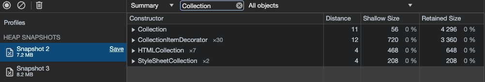
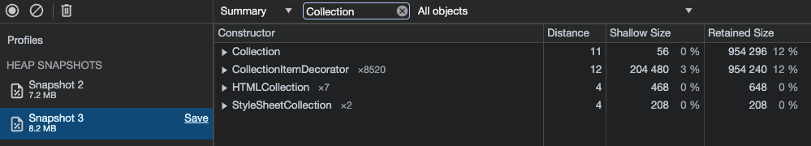
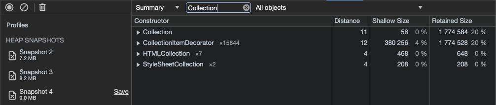
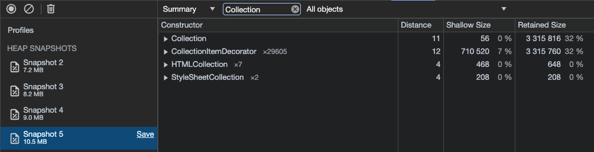
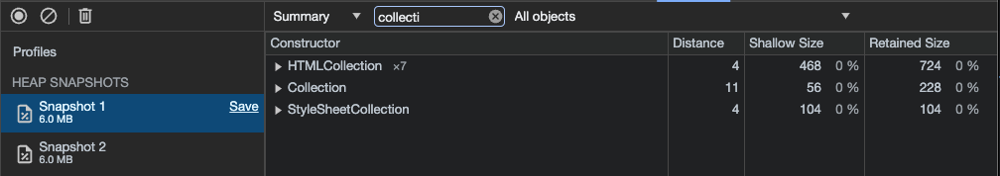
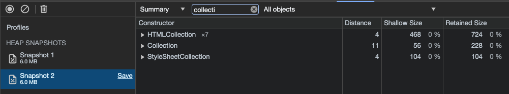

### Утечки памяти
В ходе исследования была выявлена утечка в памяти

#### Описание: 
Постоянная генерация новых объектов `Collectable`

#### Воспроизведение
1. Перейти на страницу `/game`
1. Ждать

Для тестов и большей наглядности, скорость спавна `Collectable` была увеличена в 100 раз

Постепенный рост памяти наблюдается на скриншотах ниже. Увеличивается размер `Collection` и количество объектов `CollectionItemDecorator`

#### Исправление утечки
1. Метод `spawnCollectables` класса `Collectables` стал публичным
2. Вместо вызова в конструкторе, вызов происходит в методе `gameStart` класса `GameEngine`

После внесенных исправлений утечка больше не наблюдается

